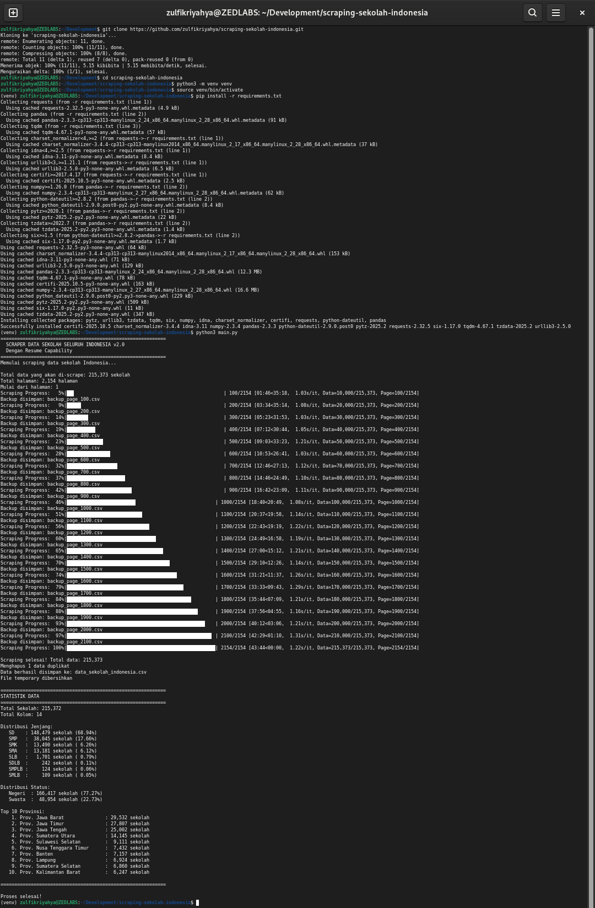

# SCRAPER DATA SEKOLAH INDONESIA (API)

Proyek ini bertujuan untuk melakukan scraping data sekolah dari API publik Sekolah Indonesia: [https://api-sekolah-indonesia.vercel.app/sekolah](https://api-sekolah-indonesia.vercel.app/sekolah). Data yang diambil meliputi informasi sekolah seperti nama, NPSN, provinsi, kabupaten/kota, dan status sekolah.

---



---

## Fitur

- Scraping data sekolah dari API dengan parameter `perPage`
- Menyimpan hasil scraping dalam format CSV
- Menyimpan checkpoint untuk melanjutkan scraping dari halaman terakhir
- Menyimpan data sementara untuk pemulihan proses
- Menampilkan progress scraping dengan `tqdm`

## Instalasi dan Setup Awal

1. Clone repositori:

   ```bash
   git clone https://github.com/zulfikriyahya/scraping-sekolah-indonesia.git
   cd scraping-sekolah-indonesia
   ```

2. Buat dan aktifkan virtual environment:

   ```bash
   python3 -m venv venv
   source venv/bin/activate
   ```

3. Instal dependensi:

   ```bash
   pip install -r requirements.txt
   ```

## Cara Penggunaan

Jalankan program utama:

```bash
python3 main.py
```

Contoh tampilan:

```
======================================================================
  SCRAPER DATA SEKOLAH INDONESIA (API)
  https://api-sekolah-indonesia.vercel.app/sekolah
======================================================================

Proses scraping akan dimulai...
Data akan disimpan di: data_sekolah_indonesia.csv
Checkpoint: scraping_checkpoint.json
```

## Catatan

- Data yang diambil bersifat publik dan tersedia melalui API resmi.
- Jika proses scraping terhenti, jalankan ulang skrip untuk melanjutkan dari checkpoint terakhir.
- Pastikan koneksi internet stabil selama proses scraping.
- Gunakan proyek ini sesuai dengan etika dan ketentuan penggunaan data.